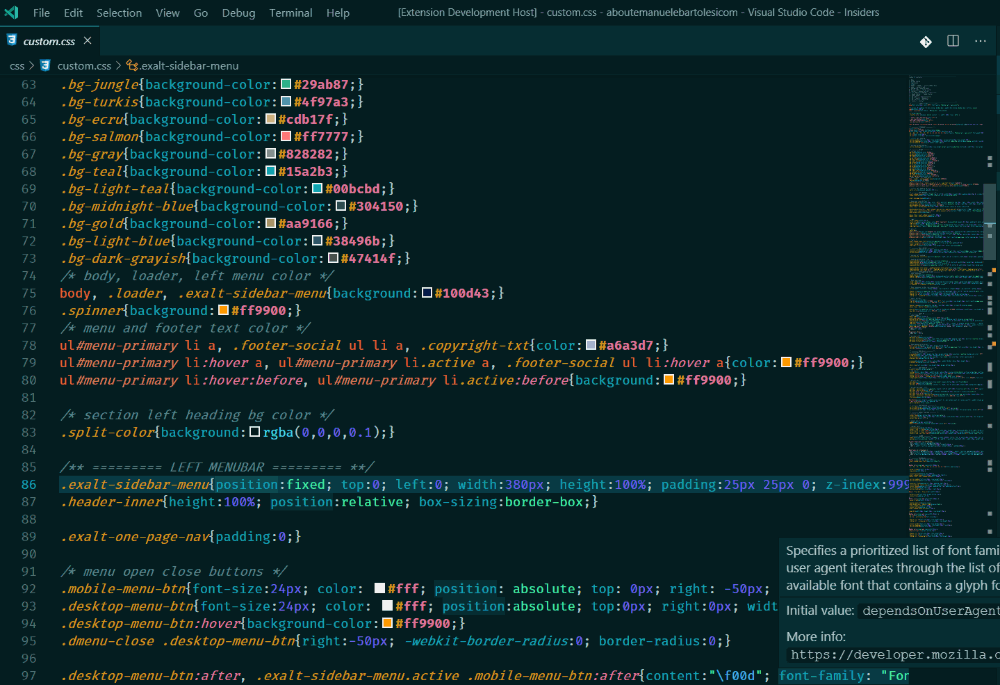

# CSS Initial Style value

With this extension you can see the initial values for each property in your CSS, Less, Sass, SCSS files.

For more information about Initial values and how they works, follow this link: [https://css-tricks.com/getting-acquainted-with-initial/](https://css-tricks.com/getting-acquainted-with-initial/)

## Features

How it works:

## Release Notes

### 1.0.0

Initial release

### 1.0.1

#### New features

- documentation url in the hover box

### 1.0.2

Changed the MDN url in the box
